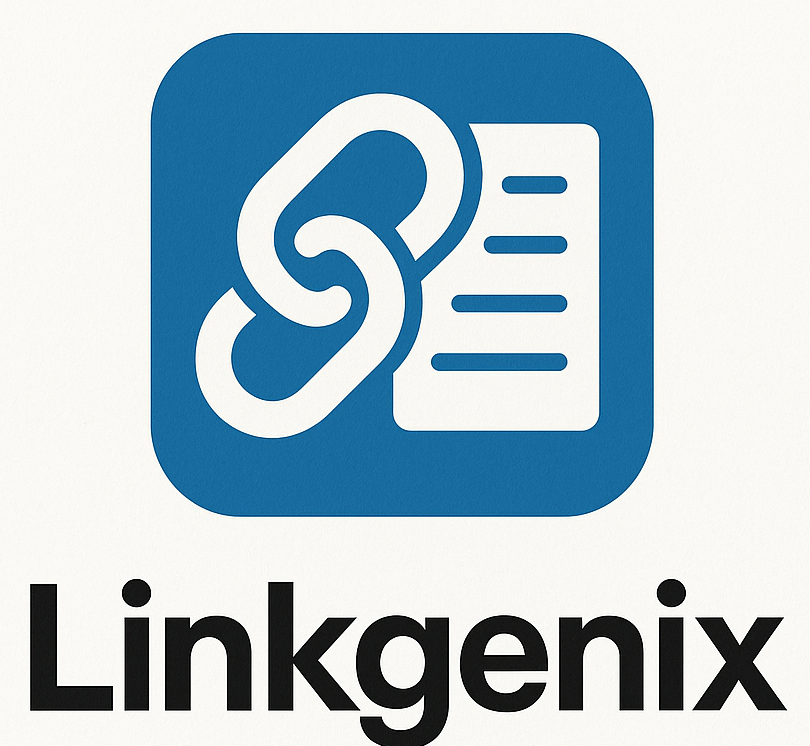

<p align="center">
  
  <br>
  <em>AI-Powered LinkedIn Content Generator</em>
</p>

## 📋 Overview

LinkGenix is an AI-powered application designed to streamline the creation of professional and engaging LinkedIn content. By leveraging advanced AI models, LinkGenix helps professionals, marketers, and content creators generate optimized LinkedIn posts with minimal effort.

## ✨ Features

- **PDF Analysis**: Upload and analyze PDF documents to extract relevant information using AI vision technology
- **Content Generation**: Create professional LinkedIn post drafts from your ideas or uploaded documents
- **Smart Formatting**: Automatically format content with appropriate structure and engaging elements
- **SEO Optimization**: Enhance your posts with relevant keywords and strategic hashtags for better reach
- **Image Generation**: Create complementary images based on your post content
- **User-Friendly Interface**: Step-by-step workflow with an intuitive Streamlit frontend
- **Comprehensive API**: Access all functionalities programmatically through REST endpoints

## 🛠️ Tech Stack

- **Backend**: Python with FastAPI
- **Frontend**: Streamlit web application
- **AI Models**:
  - Google Gemini Pro (text generation)
  - Google Gemini Flash (multimodal PDF analysis)
  - Hugging Face models (image generation)
- **Infrastructure**: Docker-ready with environment configuration

## 🚀 Getting Started

### Prerequisites

- Python 3.8 or higher
- pip (Python package installer)
- Git (for cloning the repository)
- API keys for Google AI and Hugging Face

### Installation

```bash
# Clone the repository
git clone <repository-url>
cd LinkGenix

# Create a virtual environment
python -m venv venv
source venv/bin/activate  # On Windows use `venv\Scripts\activate`

# Install dependencies
pip install -r requirements.txt

# Configure API keys
# Create or rename .env.example to .env and add your keys
```

### Running the Application

1. **Start the Backend API**:
   ```bash
   python src/api/server.py
   ```

2. **Launch the Frontend**:
   ```bash
   streamlit run frontend/app.py
   ```

3. Access the web interface at http://localhost:8501

## 💡 How LinkGenix Helps You

- **Save Time**: Generate professional LinkedIn content in minutes instead of hours
- **Improve Engagement**: Optimized content structure and relevant hashtags increase post visibility
- **Enhance Visual Appeal**: Auto-generated complementary images capture audience attention
- **Maintain Consistency**: Create regularly scheduled content with uniform quality
- **Reference External Content**: Easily incorporate insights from PDF documents into your posts

## 📚 Documentation

- [User Guide](docs/user_guide.md): Detailed instructions on using the application
- [API Documentation](docs/api_docs.md): Information for developers on API endpoints

## 📝 Workflow

1. **Input & Analysis**: Provide your topic idea and/or upload a reference PDF
2. **Generate & Format**: Create an initial draft and format it for LinkedIn
3. **Optimize & Finalize**: Add SEO improvements and generate a complementary image
4. **Publish**: Copy the optimized content to LinkedIn or save for later use

## 📷 Screenshots


<p align="center">
  <strong>User Interface</strong><br>
  
</p>

<p align="center">
  <strong>Backend API</strong><br>
  
</p>

<p align="center">
  <strong>Content Generation</strong><br>
  
</p>

<p align="center">
  <strong>SEO Optimization</strong><br>
  
</p>

## 📄 License

[MIT License](LICENSE)

---

<p align="center">
  Made with ❤️ for LinkedIn content creators
</p>
